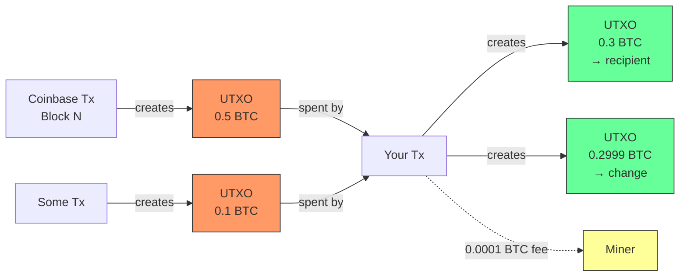

# Chapter 1: The UTXO Model

## In Satoshi's Words

> "We define an electronic coin as a chain of digital signatures. Each owner transfers the coin to the next by digitally signing a hash of the previous transaction and the public key of the next owner and adding these to the end of the coin. A payee can verify the signatures to verify the chain of ownership."
>
> — White paper, [Section 2: Transactions](https://bitcoin.org/bitcoin.pdf) (October 2008)

## The Mental Model That Makes Everything Click

Forget bank accounts. Bitcoin doesn't track balances. Instead, it tracks **unspent transaction outputs** (UTXOs) — think of them as individual coins sitting in lockboxes.

When you "have 1 BTC," what you really have is a collection of UTXOs that add up to 1 BTC. Maybe it's one UTXO worth exactly 1 BTC, or maybe it's three UTXOs worth 0.5, 0.3, and 0.2 BTC.

## UTXOs vs. Account Model

| | UTXO Model (Bitcoin) | Account Model (Ethereum, banks) |
|--|---|---|
| **State** | Set of unspent outputs | Map of address → balance |
| **Spending** | Consume entire UTXOs, create new ones | Subtract from balance |
| **Privacy** | Each UTXO is independent | Single account links all activity |
| **Parallelism** | Transactions on different UTXOs can't conflict | Same-account transactions must be ordered |

## The UTXO Lifecycle



UTXOs are created (green) by transactions and destroyed (orange) when spent. The difference between inputs and outputs is the miner fee. There is no "balance" — only unspent outputs.

## Anatomy of a Transaction

Every Bitcoin transaction does exactly one thing: **destroy old UTXOs and create new ones**.

```
INPUTS (UTXOs being spent)          OUTPUTS (new UTXOs being created)
┌─────────────────────┐            ┌─────────────────────┐
│ UTXO: 0.5 BTC       │──────────►│ 0.3 BTC → recipient │
│ (from previous tx)   │           ├─────────────────────┤
├─────────────────────┤           │ 0.2999 BTC → me     │ ← change
│ UTXO: 0.1 BTC       │           │ (back to my address) │
│ (from previous tx)   │──────────►└─────────────────────┘
└─────────────────────┘
                                    Fee = 0.6 - 0.5999 = 0.0001 BTC
```

### Key rules:

1. **Inputs must reference existing, unspent outputs** — you can't spend what doesn't exist or what's already been spent
2. **Entire UTXOs are consumed** — you can't partially spend a UTXO. If you have a 0.5 BTC UTXO and want to send 0.3, you spend the whole 0.5 and send 0.2 back to yourself as *change*
3. **Sum of inputs ≥ sum of outputs** — the difference is the miner fee (there's no explicit fee field)
4. **Each input must prove authorization** — via a digital signature (covered in [Chapter 2](02-script-system.md))

## Change Outputs

Satoshi described this pattern directly in the white paper:

> "Normally there will be either a single input from a larger previous transaction or multiple inputs combining smaller amounts, and at most two outputs: one for the payment, and one returning the change, if any, back to the sender."
>
> — White paper, [Section 9: Combining and Splitting Value](https://bitcoin.org/bitcoin.pdf)

Change is the most confusing part for newcomers. Here's why it exists:

Imagine you have a $20 bill and want to buy a $12 item. You hand over the $20 (the full UTXO), get the item ($12 to the merchant), and receive $8 back (change to yourself). You can't tear the $20 bill in half.

Bitcoin works identically. Every UTXO is an indivisible unit that must be fully consumed.

**Common gotcha:** If you forget to create a change output, the *entire difference* becomes the miner fee. People have accidentally paid hundreds of thousands of dollars in fees this way.

## The Transaction Format (Simplified)

```json
{
  "version": 2,
  "inputs": [
    {
      "txid": "abc123...",     // Which previous transaction?
      "vout": 0,               // Which output of that transaction?
      "scriptSig": "...",      // Proof you can spend it
      "sequence": 4294967293
    }
  ],
  "outputs": [
    {
      "value": 30000000,       // Amount in satoshis (0.3 BTC)
      "scriptPubKey": "..."    // Lock: who can spend this?
    },
    {
      "value": 29990000,       // Change (0.2999 BTC)
      "scriptPubKey": "..."    // Lock: back to me
    }
  ],
  "locktime": 0
}
```

### Fields explained:

- **version**: Transaction format version (1 or 2). Version 2 enables BIP 68 relative timelocks
- **inputs[].txid + vout**: Points to a specific output of a previous transaction — this is the UTXO being spent
- **inputs[].scriptSig**: The "key" that unlocks the UTXO (your signature + public key)
- **outputs[].value**: Amount in **satoshis** (1 BTC = 100,000,000 satoshis)
- **outputs[].scriptPubKey**: The "lock" — a script that defines who can spend this new UTXO
- **locktime**: Earliest time/block this transaction can be included in a block (0 = immediately)

## Fees

There is no `fee` field in a transaction. The fee is implicit:

```
fee = sum(input values) - sum(output values)
```

Miners collect the fee by including the transaction in their block. Higher fee = higher priority = faster confirmation. Fees are measured in **satoshis per virtual byte** (sat/vB), which we'll explain in [Chapter 3](03-segwit.md).

## The UTXO Set

The UTXO set is the current state of Bitcoin — every unspent output that exists right now. As of 2025, it's roughly:

- ~180 million UTXOs
- ~12 GB of data
- Stored on disk in LevelDB, with a configurable memory cache (default ~450 MB)

This is the only state a node needs to validate new transactions. You don't need the full blockchain history to know if a transaction is valid — just the current UTXO set.

## Coinbase Transactions

> "The steady addition of a constant of amount of new coins is analogous to gold miners expending resources to add gold to circulation. In our case, it is CPU time and electricity that is expended."
>
> — White paper, [Section 6: Incentive](https://bitcoin.org/bitcoin.pdf)

Every block starts with a special transaction called the **coinbase transaction**. It has:
- No inputs (it creates new bitcoin from nothing)
- Outputs totaling the block subsidy + all fees from transactions in the block

As of 2024 (post-4th halving), the block subsidy is **3.125 BTC**. The coinbase output can't be spent until 100 blocks later (coinbase maturity rule).

The very first coinbase transaction (block 0, the genesis block) contains a famous message embedded by Satoshi:

> "The Times 03/Jan/2009 Chancellor on brink of second bailout for banks"

This served as both a timestamp proof (the block couldn't have been mined before that date) and a political statement about why Bitcoin was created. The genesis block's 50 BTC coinbase is permanently unspendable — a unique property of block 0.

## Verify It Yourself

```bash
# Get a raw transaction
bitcoin-cli getrawtransaction <txid> 2

# Look at the UTXO set stats
bitcoin-cli gettxoutsetinfo

# Check if a specific output is unspent
bitcoin-cli gettxout <txid> <vout>
```

## Key Takeaways

1. Bitcoin has no balances — only UTXOs
2. Transactions consume entire UTXOs and create new ones
3. Change goes back to you (if you remember to add the output)
4. Fees = inputs - outputs (implicit, no fee field)
5. The UTXO set is Bitcoin's entire current state
6. Wallet software manages your UTXOs for you — see [Chapter 9](09-wallets-self-custody.md) for how HD wallets derive keys and track your UTXOs
7. Covenants (proposed in [Chapter 12](12-future-bitcoin.md)) would add the ability to restrict *where* UTXOs can be spent — a fundamental extension of the UTXO model

---

**Next:** [Chapter 2 — The Script System](02-script-system.md) — How those `scriptPubKey` locks actually work.
